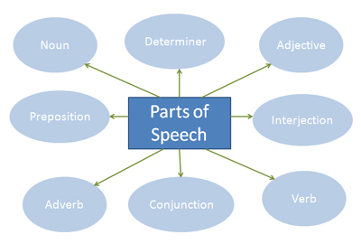

Part-of-speech tagging is the process of assigning a part-of-speech (lexical class marker) to each word in a corpus. The basic parts of speech are : Noun, Verb, Determiner, Adjective, Adverb, Preposition (in English), Postposition (in Hindi).

 

### Objective

The objective of this experiment is to test the knowledge of basic part of speech of words as they appear in a sentence.